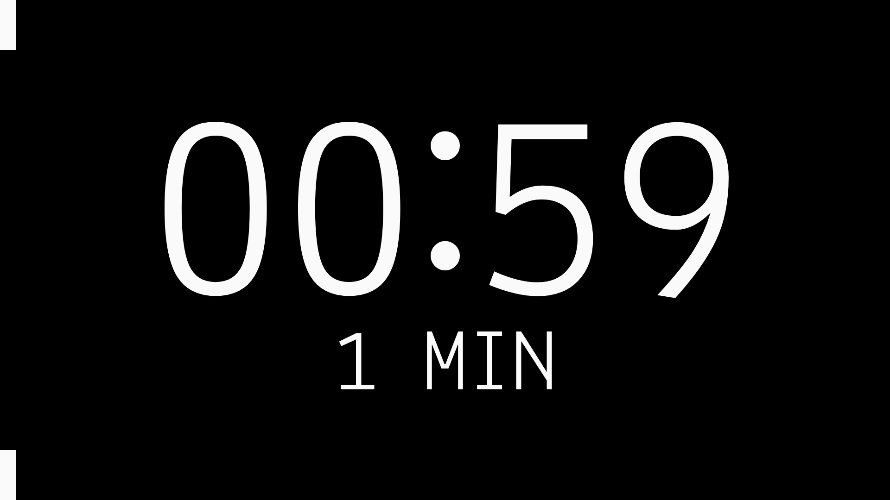

# /tick

*Tick* is shortcut-first countdown timer for your streams (e.g. [OBS browser source](https://obsproject.com/kb/browser-source)), webinars (e.g. [Zoom’s screen share](https://support.zoom.us/hc/en-us/articles/201362153-Sharing-your-screen-or-desktop-on-Zoom)), or any reverse time-keeping needs.

- [Live Demo](https://raw.githack.com/Arty2/tick/master/tick.html)
- [Project website](https://heracl.es/tick)
- Current version: `1.8` (2023-03-24)

## How to use

This is a single HTML file with no depedencies other than requiring JavaScript to be enabled, so if you wish to use this tool offline, then simply save it (Windows: <kbd>Ctrl</kbd> + <kbd>S</kbd>, MacOS: <kbd>Command</kbd> + <kbd>S</kbd>) to your device, and open it with your browser (Firefox, Chrome etc).

Always be cautious of scripts you find available online: open them in a text editor and inspect what they do.

## Options

The toolbar provides access to the manual for quick reference to mouse and keyboard shortcuts, and quick access to important toggles (sound, theme, fullscreen), timer reset, and three presets (5, 10, 25 minutes). It first appears at the bottom-right and hides itself after a few moments. Tap or hover your mouse over this area to reveal it. You may not add or subtract from the timer when paused.

### Touch controls

- *Tap* once on the timer or label to start, if not already started. *Tap* again to pause or un-pause.
- *Tap* once to reset and stop the timer, if overtime.
- *Double Tap* anywhere to go into fullscreen.
- *Swipe up* 👆 to add 10 minutes to the timer.
- *Swipe down* 👇 to subtract 5 minutes from the timer.
- *Swipe left* 👈 to add 1 minute.
- *Swipe right* 👉 to subtract 1 minute.

### Mouse controls

- *Click* once on the timer or label to start, if not already started. *Click* again to pause or un-pause.
- *Click* once to reset and stop the timer, if overtime.
- *Double Click* anywhere to go into fullscreen.
- *Scroll up* to add 1 minute.
- *Scroll down* to subtract 1 minute.

### Keyboard shortcuts

- <kbd>Enter</kbd> to start at 10 minutes. Will subsequently restart the timer.
- <kbd>Space</kbd> to start at 10 minutes, or pause if started, or restart at 10 minutes if into overtime.
- *Up arrow* <kbd>↑</kbd> to add 10 minutes to the timer.
- *Down arrow* <kbd>↓</kbd> to subtract 5 minutes from the timer.
- *Left arrow* <kbd>←</kbd> to add 1 minute.
- *Right arrow* <kbd>→</kbd> to subtract 1 minute.
- <kbd>Page Up</kbd> to go into fullscreen mode. <kbd>Page Up</kbd> or <kbd>Esc</kbd> to exit fullscreen. 
- <kbd>Page Down</kbd> to toggle the theme between dark (default) and light.
- <kbd>End</kbd> to reset and stop the timer.
- <kbd>Insert</kbd> to toggle sound mode: automatically play a bell sound when the timer goes into overtime. Off by default.
- <kbd>`</kbd> to play a bell sound on demand.
- <kbd>Delete</kbd> or <kbd>Backspace</kbd> to delete the current label and replace with text input. The label is dimmed when in edit more. <kbd>Enter</kbd> or <kbd>Esc</kbd> to confirm and exit edit mode.
- <kbd>Home</kbd> to display the manual. <kbd>Home</kbd> or <kbd>Esc</kbd> when the manual is open to hide it.

### URL parameters

Define a custom default timer, by specifying the `mins` [URL parameter](https://developer.mozilla.org/en-US/docs/Learn/Common_questions/What_is_a_URL#parameters). For example, `…/tick.html?mins=25` will make the timer start at 25 minutes ([pomodoro](https://en.wikipedia.org/wiki/Pomodoro_Technique)).

## Future improvements (maybe)

- [x] [Screen Wake](https://developer.mozilla.org/en-US/docs/Web/API/Screen_Wake_Lock_API) on fullscreen mode.
- [ ] Simple webworker and Manifest to allow saving as an app on mobile devices.
- [ ] Add an [inline](https://dev.to/ezzabuzaid/using-inline-web-workers-to-improve-ui-performance-540n) [Web Worker timer](https://hackwild.com/article/web-worker-timers/) to increase accuracy.
- [x] No option to add or remove minutes in touch devices.
	+ [x] a) Add [simple gestures](https://stackoverflow.com/a/62825217) left/right and up/down.
	+ [ ] b) Add ◀ buttons ▶ on either side of the timer, only on hover.
- [x] Split minutes over 60 into hours.
- [ ] URL Get params `URLSearchParams(window.location.search)`
	+ [x] a) to define initial timer (defaults at 10 minutes)
	+ [ ] b) modify theme colors.
	+ [ ] c) text label
- [ ] Sound option (three-state toggle) to ring bell every minute, if overtime.
- [ ] Display (bottom left) an overall timer that doesn’t reset.
- [ ] Code comments.
- [ ] Long-click or long-press to play bell sound on demand.
- [ ] Key buffer (numerals only) to modify timer minutes directly.
- [ ] Keep seconds intact when adding or subtracting minutes from or into overtime. Keeps the visual flow undisturbed.
- [ ] Control panel or sync to other windows with `BroadcastChannel` (such as [Speech Countdown Timer](https://obsproject.com/forum/resources/speech-countdown-timer.1179/))
- [ ] Local storage to remember theme and sound options.
- [ ] Implement theming settings compatible with [/valgrind](https://heracl.es/valgrind).
- [ ] Considering [hundredrabbits / Themes](https://github.com/hundredrabbits/Themes) simple theme framework; convert current themes.

## Point of view

Single page; no external assets; no build systems; functional vanilla JavaScript.
Pull requests welcome if they don’t deviate from these principles or alter coding style.

## Etymology

A tick is an atomic unit used to define system time in computing. It is also a hematophagous parasitic insect that affects humans and other animals.

## Credits

- Code based on [njallam / stream-pomodoro](https://github.com/njallam/stream-pomodoro).
- Bell sounds via [oshreiss / Working-with-the-Web-Audio-API](https://github.com/joshreiss/Working-with-the-Web-Audio-API/).
- Touch gestures based on code from [StackOverflow @Rob](https://stackoverflow.com/a/69617795).
- The font used in the screenshots above is [Lekton](https://fonts.google.com/specimen/Lekton) designed at ISIA Urbino, Italy. Specifically the [Lekton Greek](https://www.roleplay.gr/blog/greekifying-lekton-font) version designed by Manon Photopoulos, autohinted by the author.

* * *

© 2022 [Heracles Papatheodorou](https://heracl.es) a.k.a [@Arty2](https://www.twitter.com/Arty2), MIT Licence